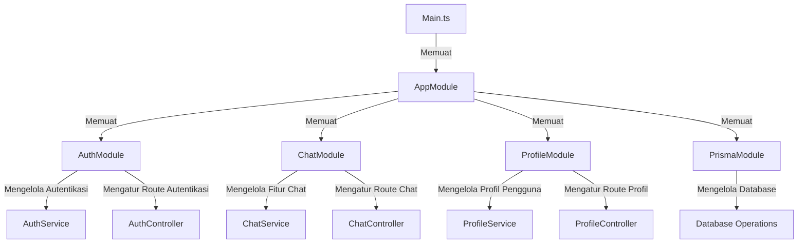
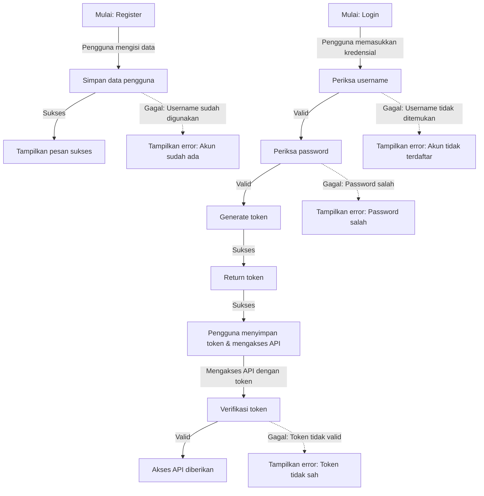
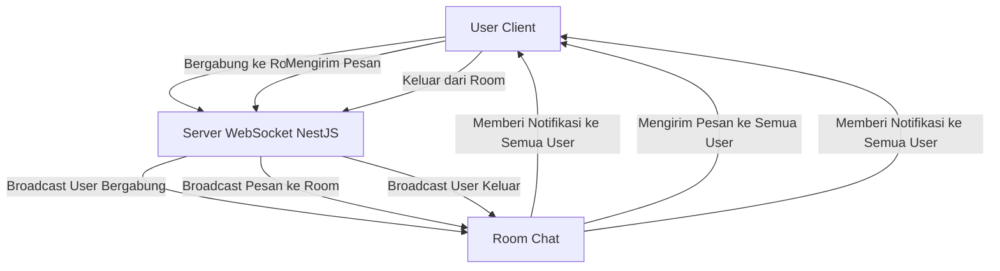

# LAPORAN LAB BACKEND NEST.JS

## 1. PENDAHULUAN
Proyek Lab Backend ini merupakan implementasi sistem backend menggunakan framework NestJS, yang dirancang untuk memenuhi kebutuhan aplikasi modern dengan fitur-fitur seperti autentikasi, chat, profil mahasiswa, dan database dengan Prisma. Dalam proyek ini, kami akan membahas bagaimana membangun aplikasi backend yang skalabel, aman, dan mudah dipelihara, serta bagaimana mengintegrasikan teknologi-teknologi seperti WebSockets dan JWT untuk menyediakan komunikasi real-time dan autentikasi pengguna yang aman. Dengan menggunakan contoh-contoh kode yang disediakan, Anda dapat mempelajari bagaimana menerapkan konsep-konsep ini dalam proyek Anda sendiri.
## 2. STRUKTUR PROYEK

Berikut ini adalah struktur proyek **Lab-NestJS**:
```
📂prisma/
│   ├── prisma.schema
📂socket/
📂public/
│   ├── 🟨app.js
│   ├── 🟧index.html
│   ├── 🟦styles.css
📂src/
│   ├── 📂chat/
│   │   ├── chat.gateaway.spec.ts
│   │   ├── chat.gateaway.ts
│   │   ├── chat.module.ts
│   │   ├── chat.service.spec.ts
│   │   ├── chat.service.ts
│   ├── 📂decorator/
│   │   ├── user.decorator.ts
│   ├── 📂dto/
│   │   ├── create-mahasiswa.dto.ts
│   │   ├── register-user.dto.ts
│   ├── 📂entity/
│   │   ├── user.entity.ts
│   ├── 📂guard/
│   │   ├── auth.guard.ts
│   ├── 📂mahasiswa-profile/
│   │   ├── mahasiswa-profile.controller.spec.ts
│   │   ├── mahasiswa-profile.controller.ts
│   │   ├── mahasiswa-profile.module.ts
│   │   ├── mahasiswa-profile.service.spec.ts
│   │   ├── mahasiswa-profile.service.ts
│   ├── 📂profile/
│   │   ├── profile.controller.spec.ts
│   │   ├── profile.controller.ts
│   │   ├── profile.module.ts
│   │   ├── profile.service.spec.ts
│   │   ├── profile.service.ts
│   ├── app.controller.spec.ts
│   ├── app.controller.ts
│   ├── app.module.ts
│   ├── app.service.ts
│   ├── auth.module.ts
│   ├── 🟦main.ts
│   ├── 🟦prisma.ts
📂test/
📂uploads/
.eslintrc.js
.gitignore
.prettierrc
README.md
nest-cli.json
package-lock.json
package.json
tsconfig.build.json
tsconfig.json


---
## 3. IMPORT LIBRARY YG DI GUNAKAN

| Nama         | Deskripsi |
|-------------|-----------|
| `NestJS`    | Framework backend berbasis TypeScript. |
| `TypeScript` | Bahasa pemrograman yang digunakan untuk membuat kode proyek. |
| `Prisma`    | ORM untuk database. |
| `PostgreSQL` | Database yang digunakan dalam proyek. |
| `Swagger`   | Library untuk mengimplementasikan dokumentasi API menggunakan Swagger. |
| `WebSockets` | Untuk komunikasi real-time dalam chat. |
| `Socket.io`  | Library untuk mengimplementasikan WebSocket. |
| `JWT (JSON Web Token)` | Untuk autentikasi pengguna. |

---

## 4. INSTALASI PROYEK NEST.JS

1. **Install NestJS CLI**
   ```sh
   npm i -g @nestjs/cli
   ```
2. **Inisialisasi Proyek NestJS**
   ```sh
   nest new nama_proyek
   ```
3. **Masuk ke Direktori Proyek**
   ```sh
   cd nama_proyek
   ```
4. **Setup Swagger**
   ```sh
   npm i --save @nestjs/swagger
   ```
5. **Buka Folder di VS Code**
   ```sh
   code .
   ```

## 5. DESKRIPSI SETIAP FILE

### 1. `prisma/schema.prisma`
File ini berisi struktur model dan enum yang digunakan dalam aplikasi. Berikut rincian setiap bagian:

#### a. **Model `Mahasiswa`**
Model ini merepresentasikan tabel untuk menyimpan informasi mahasiswa dengan atribut berikut:
- `nim`: Nomor Induk Mahasiswa (NIM)
- `nama`: Nama lengkap mahasiswa
- `kelas`: Kelas tempat mahasiswa tergabung
- `jurusan`: Program studi yang diambil mahasiswa
- `jenis_kelamin`: Jenis kelamin mahasiswa (Laki-laki / Perempuan)
- `foto_profile`: Foto profil mahasiswa (opsional)

#### b. **Enum `Jenis_Kelamin`**
Enum ini berisi pilihan untuk jenis kelamin mahasiswa:
- `L`: Laki-laki
- `P`: Perempuan

#### c. **Model `User`**
Model ini digunakan untuk menyimpan data pengguna aplikasi, dengan atribut sebagai berikut:
- `id`: ID unik pengguna
- `username`: Nama pengguna untuk login
- `password`: Kata sandi akun pengguna
- `role`: Peran pengguna dalam sistem (ADMIN atau USER)
- `foto_profile`: Foto profil pengguna (opsional)

#### d. **Enum `Role`**
Enum ini menentukan peran pengguna dalam aplikasi:
- `ADMIN`: Pengguna dengan akses penuh ke sistem
- `USER`: Pengguna dengan hak akses terbatas

---

### 2. `chat/chat.gateway.spec.ts`
File ini merupakan unit test untuk **`ChatGateway`** dalam framework **NestJS testing**. Tujuannya adalah memastikan **ChatGateway** berfungsi sebagaimana mestinya.

#### a. **Import Modul dan Layanan**
   - `Test`, `TestingModule`: Digunakan untuk membangun dan mengatur lingkungan pengujian di NestJS.
   - `ChatGateway`: Komponen WebSocket yang diuji.
   - `ChatService`: Layanan yang digunakan dalam **ChatGateway**.

#### b. **Konfigurasi Pengujian**
   - `beforeEach`: Sebelum setiap pengujian, sebuah modul pengujian dibuat dan dikompilasi. **ChatGateway** serta **ChatService** didaftarkan sebagai provider.
   - `gateway`: Menyimpan instance dari **ChatGateway** yang siap diuji.

#### c. **Pengujian Unit**
   - `it('should be defined', ...)`: Memastikan bahwa instance **ChatGateway** berhasil dibuat setelah pengaturan modul pengujian.

---

### 3. `chat/chat.gateway.ts`
File ini mendefinisikan **WebSocket Gateway** menggunakan **Socket.IO** untuk fitur chat aplikasi.

#### a. **Dekorator `@WebSocketGateway()`**
Dekorator ini mengatur konfigurasi WebSocket Gateway, termasuk pengaturan CORS agar dapat diakses dari berbagai domain serta path koneksi `/socket`.

#### b. **Properti `server`**
Menggunakan dekorator `@WebSocketServer()` untuk mendeklarasikan instance **Socket.IO Server**, yang berfungsi untuk mengirim pesan ke seluruh klien yang terhubung.

#### c. **Manajemen Pengguna**
Data pengguna disimpan dalam struktur `users`, yang memetakan ID socket dengan informasi seperti `username` dan `room`.

#### d. **Fungsi `handleConnection()`**
Menangani koneksi baru ke server WebSocket, serta mencatat ID pengguna yang terhubung.

#### e. **Fungsi `handleDisconnect()`**
Mengelola pemutusan koneksi pengguna. Jika pengguna sedang berada dalam room tertentu, mereka akan dikeluarkan, dan pesan notifikasi akan dikirimkan ke room tersebut.

#### f. **Fungsi `handleJoinRoom()`**
Menangani permintaan untuk bergabung ke room chat tertentu. Pengguna yang valid akan dimasukkan ke dalam room, dan pesan notifikasi akan dikirim ke semua anggota room.

#### g. **Fungsi `handleLeaveRoom()`**
Memproses permintaan pengguna untuk keluar dari room chat dan memberi tahu anggota room lainnya.

#### h. **Fungsi `handleRoomMessage()`**
Memfasilitasi pengiriman pesan dalam room tertentu. Jika pesan valid, maka akan dikirimkan ke semua anggota dalam room tersebut.

---

### 4. `chat/chat.module.ts`
File ini mendeklarasikan **ChatModule**, yang merupakan modul utama untuk fitur chat dalam aplikasi.

#### a. **Dekorator `@Module()`**
Digunakan untuk mendeklarasikan modul dalam NestJS. Modul **ChatModule** mencakup:
- **`ChatService`**: Layanan untuk mengelola logika aplikasi chat.
- **`ChatGateway`**: WebSocket gateway yang menangani komunikasi real-time.

#### b. **Providers**
Modul ini menyertakan **ChatService** dan **ChatGateway** dalam daftar provider, sehingga dapat digunakan dalam bagian lain dari aplikasi.

---

### 5. `dto/create-mahasiswa.dto.ts`
File ini mendefinisikan **Data Transfer Object (DTO)** yang digunakan saat membuat data mahasiswa baru. DTO ini membantu validasi dan dokumentasi struktur data yang diterima melalui API.

#### a. **Dekorator `@ApiProperty()`**
Dekorator ini digunakan dalam Swagger untuk mendokumentasikan properti DTO dan memberikan informasi terkait tipe serta contoh data yang diharapkan.

#### b. **Properti DTO**
1. **`nim` (Nomor Induk Mahasiswa)**
   - Harus berupa string dan tidak boleh kosong.
   - Panjangnya antara 1 hingga 12 karakter.

2. **`nama` (Nama Mahasiswa)**
   - Harus berupa string dan tidak boleh kosong.
   - Panjangnya antara 1 hingga 50 karakter.

3. **`kelas`**
   - Harus berupa string dan memiliki panjang 1 hingga 2 karakter.

4. **`jurusan`**
   - Harus berupa string dan memiliki panjang 1 hingga 12 karakter.

5. **`jenis_kelamin`**
   - Harus sesuai dengan nilai enum (`L` atau `P`).

---

### 6. `mahasiswa-profile/mahasiswa-profile.controller.ts`
File ini merupakan **Controller** untuk menangani fitur upload dan pengambilan foto profil mahasiswa berdasarkan **NIM**.

#### a. **Dekorator `@Controller()`**
Menentukan rute dasar API untuk fitur ini, yaitu `mahasiswa-profile`.

#### b. **Endpoint API**
1. **`POST /mahasiswa-profile/upload`**
   - Menerima file foto profil dan **NIM** mahasiswa.
   - Jika tidak ada file atau NIM, akan mengembalikan error.

2. **`GET /mahasiswa-profile/:nim`**
   - Mengambil foto profil berdasarkan **NIM**.
   - Jika data tidak ditemukan, akan mengembalikan error **NotFoundException**.

---

### 7. `mahasiswa-profile/mahasiswa-profile.service.ts`
File ini menangani logika terkait pengelolaan foto profil mahasiswa.

#### a. **Metode `uploadFile()`**
1. Mencari data mahasiswa berdasarkan **NIM**.
2. Jika mahasiswa ditemukan, file akan disimpan dalam direktori `uploads`.
3. Nama file disimpan dalam database.

#### b. **Metode `sendMyFotoProfile()`**
1. Mengambil nama file foto profil berdasarkan **NIM**.
2. Jika mahasiswa tidak memiliki foto profil, akan mengembalikan error.

---

### 11. `profile/profile.controller.ts`
File ini berisi **Controller** untuk menangani API terkait pengelolaan foto profil pengguna. Controller ini berfungsi untuk meng-upload dan mengambil foto profil pengguna menggunakan **NestJS**.

#### a. **Rute API:**

1. **`POST /profile/upload`**
   - Fungsi: Meng-upload foto profil pengguna.
   - Deskripsi: Endpoint ini menerima file foto profil yang akan di-upload. File disertakan dalam body permintaan dan diproses menggunakan **Multer**.
   - **Dekorator:**
     - `@UseInterceptors(FileInterceptor('file'))`: Menggunakan interceptor untuk menangani upload file.
   - Validasi:
     - Jika tidak ada file yang di-upload, akan melemparkan **BadRequestException** dengan pesan "File tidak boleh kosong!!".
   - Fungsi ini memanggil `profileService.uploadFile()` untuk menangani proses upload dan menyimpan file.

2. **`GET /profile/:id`**
   - Fungsi: Mengambil foto profil pengguna berdasarkan **ID** pengguna.
   - Deskripsi: Endpoint ini mengembalikan file foto profil pengguna berdasarkan **ID** yang diberikan dalam parameter URL. Foto profil diambil dari folder `uploads` dan dikirimkan ke klien.
   - Validasi:
     - Fungsi ini memanggil `profileService.sendMyFotoProfile()` untuk mengambil nama file foto profil berdasarkan **ID** pengguna, dan mengembalikannya ke klien.
   - Menggunakan `@Res()` untuk mengirim file gambar ke pengguna menggunakan **express**.
---
### 12. `profile/profile.service.ts`
File ini berisi **Service** yang menangani logika bisnis terkait pengelolaan foto profil pengguna, termasuk meng-upload dan menghapus foto profil yang ada.

#### a. **Metode `uploadFile()`**
Fungsi ini bertanggung jawab untuk meng-upload foto profil pengguna ke server dan memperbarui informasi foto profil di database.

1. **Langkah-langkah:**
   - Mencari pengguna berdasarkan **ID** yang diberikan menggunakan **Prisma ORM**.
   - Jika pengguna tidak ditemukan, melemparkan **NotFoundException** dengan pesan "Tidak Menemukan User".
   - Jika pengguna sudah memiliki foto profil, file foto lama dihapus dari server.
   - Memastikan direktori `uploads` ada, jika belum maka membuatnya.
   - Menyusun nama file unik dengan menggunakan **username** pengguna, timestamp, dan ekstensi file.
   - Menulis file yang diterima ke dalam direktori `uploads`.
   - Memperbarui field `foto_profile` pada data pengguna di database dengan nama file yang baru.

2. **Validasi:**
   - Jika pengguna dengan **ID** yang diberikan tidak ditemukan, melemparkan **NotFoundException** dengan pesan "Tidak Menemukan User".

3. **Output:**
   - Mengembalikan objek yang berisi nama file dan path file yang disimpan di server.

#### b. **Metode `sendMyFotoProfile()`**
Fungsi ini bertanggung jawab untuk mengembalikan nama file foto profil pengguna berdasarkan **ID** yang diberikan.

1. **Langkah-langkah:**
   - Mencari data pengguna berdasarkan **ID** yang diberikan.
   - Jika pengguna tidak ditemukan, melemparkan **NotFoundException** dengan pesan "Tidak Menemukan User".
   - Mengembalikan nama file foto profil pengguna.

2. **Validasi:**
   - Jika pengguna dengan **ID** yang diberikan tidak ditemukan, melemparkan **NotFoundException** dengan pesan "Tidak Menemukan User".
---
### 13. `src/app.controller.ts`
File ini berisi **Controller** yang menangani berbagai rute API untuk aplikasi mahasiswa, termasuk pendaftaran, login, pengelolaan data mahasiswa, dan pencarian mahasiswa. Controller ini menyediakan autentikasi dan mengelola CRUD (Create, Read, Update, Delete) data mahasiswa.

#### a. **Rute API:**

1. **`POST /register`**
   - Mendaftarkan pengguna baru.
   - Menerima data pengguna baru seperti username dan password.
   - Menggunakan `@ApiBody()` untuk mendokumentasikan tipe data `RegisterUserDTO`.
   - Mengarahkan permintaan ke `appService.register()`.

2. **`POST /login`**
   - Login pengguna dan mengembalikan token autentikasi.
   - Menerima data pengguna dan mengembalikan token autentikasi.
   - Menggunakan `@ApiBody()` untuk mendokumentasikan tipe data `RegisterUserDTO`.
   - Menggunakan `res.cookie()` untuk mengatur cookie dengan token.
   - Mengarahkan permintaan ke `appService.login()`.

3. **`GET /`**
   - Mengembalikan pesan hello dari aplikasi.

4. **`GET /mahasiswa`**
   - Mengambil data mahasiswa.
   - Mengarahkan permintaan ke `appService.getMahasiswa()`.

5. **`GET /mahasiswa/:nim`**
   - Mengambil data mahasiswa berdasarkan **NIM**.
   - Mengarahkan permintaan ke `appService.getMahasiswByNim()`.

6. **`GET /auth`**
   - Mengembalikan informasi pengguna yang sedang login.
   - Menggunakan `@ApiBearerAuth()` untuk autentikasi dengan token.
   - Menggunakan `@UserDecorator()` untuk mendapatkan informasi pengguna yang sedang login.

7. **`POST /mahasiswa`**
   - Menambahkan data mahasiswa baru.
   - Menggunakan `@ApiBody()` untuk mendokumentasikan tipe data `CreateMahasiswaDTO`.
   - Mengarahkan permintaan ke `appService.addMahasiswa()`.

8. **`PUT /mahasiswa/:nim`**
   - Memperbarui data mahasiswa berdasarkan **NIM**.
   - Menggunakan `@ApiBody()` untuk mendokumentasikan tipe data `CreateMahasiswaDTO`.
   - Mengarahkan permintaan ke `appService.updateMahasiswa()`.

9. **`DELETE /mahasiswa/:nim`**
   - Menghapus data mahasiswa berdasarkan **NIM**.
   - Mengarahkan permintaan ke `appService.menghapusMahasiswa()`.

10. **`GET /pencarian/mahasiswa`**
    - Mencari mahasiswa berdasarkan **NIM**, **nama**, atau **jurusan**.
    - Menggunakan `@ApiQuery()` untuk mendokumentasikan parameter query `nim`, `nama`, dan `jurusan`.
    - Mengarahkan permintaan ke `appService.pencarianMahasiswa()`.

---

### 14. `src/app.module.ts`
File ini mendefinisikan **AppModule**, yang merupakan modul utama dalam aplikasi.

#### a. **Dekorator `@Module()`**

1. **`imports`**:
   - `JwtModule.register()`: Mengonfigurasi **JWT (JSON Web Token)**.
   - `ProfileModule`, `ChatModule`, `MahasiswaProfileModule`.

2. **`controllers`**:
   - `AppController`

3. **`providers`**:
   - `AppService`, `PrismaService`

---

### 15. `src/app.service.ts`
File ini berisi **Service** yang menangani logika bisnis utama.

#### a. **Metode `register()`**
- Memeriksa apakah username sudah terdaftar.
- Mengenkripsi password menggunakan **bcrypt**.
- Menyimpan pengguna baru ke database.

#### b. **Metode `login()`**
- Mencari pengguna berdasarkan username.
- Memvalidasi password dengan **bcrypt**.
- Menghasilkan token JWT.

#### c. **Metode `auth()`**
- Mengembalikan informasi pengguna berdasarkan **user_id**.

#### d. **Metode `getMahasiswa()`**
- Mengembalikan daftar mahasiswa.

#### e. **Metode `addMahasiswa()`**
- Menambahkan data mahasiswa baru.

#### f. **Metode `getMahasiswByNim()`**
- Mengambil data mahasiswa berdasarkan **NIM**.

#### g. **Metode `menghapusMahasiswa()`**
- Menghapus data mahasiswa berdasarkan **NIM**.

#### h. **Metode `updateMahasiswa()`**
- Memperbarui data mahasiswa berdasarkan **NIM**.

#### i. **Metode `pencarianMahasiswa()`**
- Mencari mahasiswa berdasarkan **NIM**, **nama**, dan **jurusan**.

---

### 16. `src/auth.guard.ts`
File ini berisi **AuthGuard**, yang menangani autentikasi berbasis token JWT.

#### a. **Metode `canActivate()`**
1. Mengambil header Authorization.
2. Memeriksa keberadaan token.
3. Memvalidasi token JWT menggunakan **JwtService**.
4. Mencari pengguna berdasarkan payload.
5. Jika valid, mengizinkan akses ke rute.

---

### 17. `src/auth.module.ts`
File ini berisi **AuthModule**, yang bertanggung jawab untuk autentikasi pengguna.

#### a. **Dekorator `@Global()`**
- Menandakan bahwa **AuthModule** bersifat global.

#### b. **Dekorator `@Module()`**

1. **`providers`**:
   - `AppService`, `PrismaService`

2. **`exports`**:
   - `AppService`, `PrismaService`
## **18. `src/main.ts`**  
File ini merupakan titik masuk utama aplikasi **NestJS**. Di dalamnya, aplikasi dikonfigurasi, dijalankan, dan fitur tambahan seperti **Swagger** dan **Global Pipes** diterapkan.  

### **a. Deklarasi dan Pembuatan Aplikasi NestJS**  

1. **`NestFactory.create(AppModule)`**  
   - Membuat instance aplikasi menggunakan **AppModule**, yang berisi konfigurasi utama seperti routing, middleware, dan provider.  

2. **`app.use(cookieParser())`**  
   - Middleware untuk membaca **cookie** dari permintaan pengguna.  

3. **`app.enableCors()`**  
   - Mengaktifkan **CORS** agar aplikasi dapat menerima permintaan dari sumber lain.  

4. **`app.useGlobalPipes(new ValidationPipe({ transform: true }))`**  
   - Menggunakan **ValidationPipe** untuk validasi input secara otomatis.  
   - Opsi `transform: true` memungkinkan konversi otomatis data berdasarkan DTO.  

### **b. Konfigurasi Swagger (API Documentation)**  

1. **`DocumentBuilder`**  
   - Menyusun konfigurasi Swagger, termasuk judul, deskripsi, versi API, dan autentikasi **Bearer Token**.  

2. **`SwaggerModule.createDocument()`**  
   - Menghasilkan dokumentasi API berdasarkan konfigurasi yang dibuat.  

3. **`SwaggerModule.setup()`**  
   - Menyediakan endpoint `/api-docs` untuk akses dokumentasi API melalui Swagger UI.  

### **c. Menjalankan Aplikasi**  

1. **`await app.listen(process.env.PORT ?? 3000)`**  
   - Menjalankan aplikasi di **port yang ditentukan** dalam `.env`, atau default ke `3000`.  

---

## **19. `src/user.decorator.ts`**  
File ini berisi **custom decorator** untuk mendapatkan informasi pengguna yang telah terautentikasi dari objek permintaan.  

### **a. Dekorator `@UserDecorator()`**  

1. **Fungsi `createParamDecorator()`**  
   - Digunakan untuk membuat **decorator kustom** pada parameter metode dalam controller.  

2. **Logika di dalam decorator**  
   - Mengambil objek permintaan (`request`) dari **ExecutionContext** dan membaca `request.user`.  
   - **AuthGuard** mengatur `request.user` setelah token diverifikasi.  

---

## **20. `.env`**  
File ini menyimpan **variabel lingkungan** yang digunakan untuk konfigurasi aplikasi, termasuk:  
- **Koneksi database**  
- **Secret key untuk JWT**  
- **Port aplikasi**  

---

## **21. `.gitignore`**  
File ini menentukan file dan direktori yang **tidak akan di-track oleh Git**, seperti:  
- `node_modules/`  
- `.env`  
- `dist/` (hasil build aplikasi)  

---

## **22. `package-lock.json`**  
File ini dihasilkan otomatis oleh **npm** untuk **mengunci versi dependensi**, memastikan semua pengembang menggunakan versi yang sama.  

---

## **23. `package.json`**  
File ini berisi informasi proyek, termasuk:  
- **Dependensi** (seperti NestJS, Prisma, dll.)  
- **Script npm** (`npm start`, `npm run dev`, dll.)  
- **Versi aplikasi**  

---

## **24. `README.md`**  
Dokumentasi utama proyek, yang biasanya mencakup:  
- **Deskripsi proyek**  
- **Cara instalasi dan penggunaan**  
- **Struktur folder**  
- **Panduan kontribusi**  

---
## 6. DIAGRAM ARSITEKTUR  

Diagram berikut menggambarkan struktur arsitektur proyek dan bagaimana modul saling berhubungan:  



### **Penjelasan Arsitektur:**  
1. **`Main.ts`**  
   - Entry point utama aplikasi yang memuat **AppModule** sebagai modul utama.  

2. **`AppModule`**  
   - Modul utama yang mengelola seluruh modul lainnya seperti **AuthModule**, **ChatModule**, **ProfileModule**, dan **PrismaModule**.  

3. **`AuthModule`**  
   - Mengatur autentikasi pengguna menggunakan **AuthService** dan **AuthController**.  

4. **`ChatModule`**  
   - Mengelola fitur chat melalui **ChatService** dan **ChatController**.  

5. **`ProfileModule`**  
   - Mengelola data profil pengguna menggunakan **ProfileService** dan **ProfileController**.  

6. **`PrismaModule`**  
   - Modul database yang menangani semua operasi database melalui **Database Operations**.  

Diagram ini memberikan gambaran alur kerja dan hubungan antar modul dalam aplikasi **Lab-NestJS**.  

---
## 7. ALUR KERJA REGISTER, LOGIN, DAN AUTHENTICATION  

Diagram berikut menggambarkan proses registrasi, login, dan autentikasi pengguna menggunakan token:  



### **Penjelasan Alur:**  
1. **Registrasi Pengguna:**  
   - Pengguna mengisi data untuk mendaftar.  
   - Jika username belum digunakan, sistem menyimpan data pengguna dan menampilkan pesan sukses.  
   - Jika username sudah ada, sistem menampilkan error.  

2. **Login dan Autentikasi:**  
   - Pengguna memasukkan kredensial (username & password).  
   - Jika username tidak ditemukan, sistem menampilkan error.  
   - Jika password salah, sistem menampilkan error.  
   - Jika valid, sistem menghasilkan token untuk autentikasi dan mengembalikannya ke pengguna.  

3. **Autentikasi Token:**  
   - Pengguna mengakses API dengan token yang telah diberikan.  
   - Sistem memverifikasi token:  
     - Jika valid, akses API diberikan.  
     - Jika tidak valid, sistem menampilkan error.  

---
## 8. SKEMA ALUR CHAT ROOM MENGGUNAKAN WEBSOCKET  

Diagram berikut menggambarkan alur komunikasi dalam chat room menggunakan WebSocket:  



Dalam skema ini:  
- **User Client** dapat bergabung ke dalam chat room melalui WebSocket Server.  
- **Server WebSocket (NestJS)** menangani koneksi, mengelola pesan, dan menyiarkan status pengguna kepada semua user dalam room.  
- **Room Chat** bertindak sebagai pusat komunikasi, di mana setiap pesan atau perubahan status akan diberitahukan ke seluruh user yang sedang terhubung.  

---
## 9. LANGKAH MENJALANKAN PROYEK  

1. **Clone Repository**  
   Jalankan perintah berikut untuk menyalin repository proyek ke dalam komputer Anda:  
   ```sh
   git clone <repo-url>
   cd lab-nestjs
   ```  

2. **Instalasi Dependensi**  
   Setelah masuk ke direktori proyek, instal semua dependensi yang diperlukan dengan menjalankan:  
   ```sh
   npm install
   ```  

3. **Menjalankan Server**  
   Gunakan salah satu perintah berikut untuk memulai server:  
   ```sh
   npm start       # Menjalankan server dalam mode produksi  
   npm run start:dev  # Menjalankan server dalam mode pengembangan  
   ```  

4. **Mengakses API**  
   Setelah server berjalan, API dapat diakses melalui:  
   - **Endpoint utama:** `http://localhost:3000`  
   - **Dokumentasi Swagger:** `http://localhost:3000/api-docs`  

---


## 10. KESIMPULAN
Proyek ini mengimplementasikan backend menggunakan Express.js dengan fitur utama seperti autentikasi JWT, database Sequelize, dan komunikasi real-time dengan WebSockets. Dengan pendekatan modular dan keamanan berbasis enkripsi serta validasi input, aplikasi ini dapat digunakan sebagai fondasi yang solid untuk pengembangan lebih lanjut. Dokumentasi menggunakan Swagger UI memastikan API mudah dipahami dan digunakan oleh pengembang lain.
